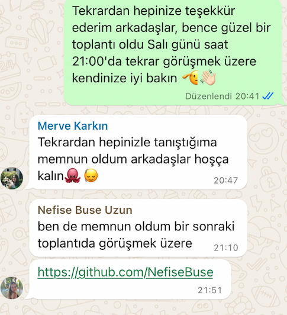

<html>
  <body>

  # **Takım ve Ürün İsmi**

  ### **`Grup 71 - Aramızda`** 

  # Takım ve Ürün Hakkında Bilgiler

  ## Takım Üyeleri
  <table>
    <tr>
      <th>İsim</th>
      <th>Görev</th>
      <th>Github&LinkedIn</th>
    </tr>
    <tr>
      <td>Mehmet Akif Özden</td>
      <td>Scrum Master/Developer</td>
      <td>
        

        

      </td>
    </tr>
    <tr>
      <td>Nefise Buse Uzun</td>
      <td>Product Owner/Developer</td>
       <td>
        

        

       </td>
    </tr>
    <tr>
      <td>Merve Karkın</td>
      <td>Developer</td>
       <td>
        

        

       </td>
    </tr>
    <tr>
      <td>Neslihan Gürgen</td>
      <td>Developer</td>
       <td>
        

        

       </td>
    </tr>
    <tr>
      <td>Mehmet Ali Keklik</td>
      <td>Developer</td>
       <td>
        

        

       </td>
    </tr>
  </tr>
  </table>

  ## Ürün Tanımı
  Uygulamamız para kullanmadan 2. el ürün alışverişi üzerine kurulu benzersiz ve farklı özelliklere sahip bir takas uygulaması olmayı amaçlamaktadır. Uygulamanın amacı, kullanıcıların israfı önlemelerine, birikimlerini korumalarına ve çevreye duyarlı bir şekilde alışveriş yapmalarına yardımcı olmaktır. Geliştireceğimiz uygulama, ikinci el eşyaların takas edilmesini sağlayarak israfı önlemeyi ve kullanıcıların tasarruf yapmasını hedefleyen bir platform olacaktır. Kullanıcılar, kullanmadıkları eşyaları başkalarıyla takas ederek ihtiyaçlarını karşılayacak ve sürdürülebilir bir yaşam tarzına katkıda bulunacaklardır.

  

    
<h2>Ürün Özellikleri</h2>

  <h2>Beceri/Yetenek Takası:</h2>
    
Kullanıcıların birbirleriyle hizmet veya becerilerini takas etmelerine olanak tanıyan bir özellik.

  <h2>İhtiyaç Duyulan Ürün Eşleştirme:</h2>
    
Kullanıcıların ihtiyaç duydukları ürünleri belirtmelerine ve uygulamaya hangi ürünlerin ihtiyaç duyulduğunu bildirmelerine olanak tanıyan bir AI destekli sistem.

  <h2>Ödül ve Sadakat Sistemi:</h2>
    
Sanal Para Birimi: Kullanıcıların uygulama içi para birimi kazanabilecekleri ve bu parayı diğer ürünler için indirim almak veya uygulama içi hizmetler satın almak için kullanabilecekleri bir sistem. Her takas işlemi, kullanıcıya puan kazandırır. Ayrıca rozetler ve kullanıyı seviyeleri sistemiyle kullanıcılar, belirli hedeflere ulaştıkça rozetler ve seviyeler kazanır.

  <h2>Sosyal Medya Etkileşimi</h2>
    
Kullanıcılar, takas ettikleri ürünleri sosyal medya platformlarında paylaşabilir. Böyle hem uygulamayı kullanmayan çevrelerini uygulama kullanmaya teşvik edebilir hem de ürünlerinin takasa açık olduğunu kendi çevresiyle paylaşmış olur.

  <h2>Bağış Sistemi:</h2>
    
 Kullanıcıların kullanmadıkları ürünleri ihtiyaç sahiplerine bağışlamalarına olanak sağlar.

  <h2>Arama, Kategori ve Filtreleme:</h2>
    
Kullanıcıların aradıkları ürünleri kategoriye, konuma, anahtar kelimeye ve diğer kriterlere göre filtrelemelerini sağlar.

  <h2>Kullanıcı Profili ve Doğrulama:</h2>
    
Kullanıcıların ilgi alanlarını ve takas tercihlerini paylaşabilecekleri profiller oluşturmaları sağlanır. Ayrıca telefon numarası, e-posta ve sosyal medya hesapları ile kullanıcı doğrulaması sağlanarak güvenliğe katkı sağlanmış olur.

  <h2>Takas Teklifleri ve İletişim:</h2>
    
Kullanıcıların potansiyel alıcılar ve satıcılar ile uygulama üzerinden iletişim kurmaları sağlanır. Kullanıcıların ilgilendikleri ürünler için kendi ürünlerini teklif edebilmesi sağlanır ve anlık mesajlaşma ile takas şartlarının konuşulması ve anlaşılması hedeflenir.

  <h2>Favoriler ve Kaydedilenler:</h2>
    
Kullanıcıların beğendikleri ve değerlendirmek istedikleri ürünleri daha sonra takas yaparak değerlendirmek için kaydedebildikleri bir liste imkanı sağlar.

  <h2>Güvenlik ve Değerlendirme Sistemi:</h2>
    
Takas gerçekleştikten sonra kullanıcıların birbirlerini değerlendirmesi sağlanır. Bu şekilde kullanıcı profilleri ve takas işlemi puanlanmış olur. Sonraki takaslarda diğer kullanıcıların dikkate alabileceği bir ön kriter sağlanmış olur.

  <h2>Ürün Ekleme:</h2>
    
Kullanıcıların fotoğraf ve açıklama ekleyerek takas etmek istedikleri ürünleri kolayca listelemeleri sağlanır.

  <h2>Akıllı Öneriler ve Yapay Zeka:</h2>
    
Kullanıcıların geçmiş arama ve takas davranışlarına göre kişiselleştirilmiş ürün önerileri sağlanır.

  

  

    
<h2>Ürünün Hedef Kitlesi</h2>

  * <h2>Ana Hedef Kitle:<h2>
1. Çevreye Duyarlı Kişiler: Sürdürülebilir bir yaşam tarzı benimseyen ve atık oluşumunu azaltmak isteyen kişiler. Bu kitle, uygulama aracılığıyla daha az ürün satın alarak ve daha fazla ürün takas ederek çevresel ayak izlerini küçültmeyi amaçlar.
2. Maddi Tasarruf Etmek İsteyenler: Bütçelerini kontrol altında tutmak ve para tasarrufu yapmak isteyen kişiler. Bu kitle, uygulamada kullanmadıkları ürünleri takas ederek satın almak yerine yeni ürünler edinmeyi amaçlar.
3. Benzersiz Ürün Arayanlar: Seri üretim ürünlerden sıkılan ve özgün ve vintage ürünler arayan kişiler. Bu kitle, uygulamada nadir ve özel ürünler keşfederek tarzlarını yansıtmayı amaçlar.
4. Yeni İnsanlarla Tanışmak İsteyenler: Sosyalleşmek ve yeni insanlarla tanışmak isteyen kişiler. Bu kitle, uygulamada ortak ilgi alanlarına sahip kişilerle bağlantı kurarak yeni bağlantılar kurmayı amaçlar.
  * <h2>Alt Hedef Kitleler:<h2>
1. Öğrenciler: Bütçeleri kısıtlı olan ve yeni ürünlere ihtiyaç duyan öğrenciler.
2. Ev Hanımları: Kullanmadıkları ev eşyalarını ve kıyafetlerini satmak veya takas etmek
isteyen ev hanımları.
3. Koleksiyoncular: Nadir ve özel ürünler arayan koleksiyoncular.
4. El Sanatları ve El Yapımı Ürün Üreticileri: Ürünlerini satmak veya takas etmek isteyen el
sanatları ve el yapımı ürün üreticileri.
5. Yerel İşletmeler: Kullanılmayan stoklarını satmak veya takas etmek isteyen yerel
işletmeler.

* <h4>Hedef Kitlenin Demografik Özellikleri:<h4>

  * Yaş: 18-55 yaş arası
  * Cinsiyet: Erkek ve kadın
  * Gelir: Düşük, orta ve yüksek gelirli
  * Eğitim: Lise, üniversite ve üzeri
  * Meslek: Öğrenci, ev hanımı, serbest meslek sahibi, memur, işçi vb.
  * Yaşam Tarzı: Çevreye duyarlı, tasarruflu, özgün, sosyal

* <h4>Hedef Kitlenin Psikolojik Özellikleri:<h4>
  
  * Çevre Bilinci: Çevreyi korumaya ve sürdürülebilir bir yaşam tarzı benimsemeye önem veren kişiler.
  * Tasarruflu Düşünce: Paralarını bilinçli bir şekilde harcamak ve israftan kaçınmak isteyen kişiler.
  * Sosyalleşme İhtiyacı: Yeni insanlarla tanışmak ve sosyalleşmek isteyen kişiler.
    
  

  --- 

  

    
<h1>1. Sprint</h1>

  

    
<h3>Sprint 1 - Uygulama Tasarım Görüntüleri</h3>

    (Tasarım ve Frontend ekibi tasarım çalışmalarına aktif olarak devam ettiği için final tasarımı değil güncel tasarımı temsil eder.)
  
  <table style="width: 100%;">
    <tr>
      <td colspan="4" style="text-align: center;"><h2>Figma Tasarımları</h2></td>
    </tr>
    
    <tr>
      <td style="width: 25%;"></td>
    </tr>
    
    <tr>
      <td colspan="4" style="text-align: center;"><h2>Sign ve Login Ekranları</h2></td>
    </tr>
    <tr>
      <td style="width: 25%;"></td>
    </tr>
  </table>
  
   

  

    
<h3>Sprint 1 - Sprint Tahtası Güncelleme Ekran Görüntüleri</h3>

    
    
    
    
  

  - **Sprint Notları**:

      * Proje yönetimini kolaylaştırmak için `Miro` aracı oy birliğiyle seçildi.

      * Ön tasarım çalışmaları ve örnek sayfalar için Frontend-UI/UX ekibi `Figma` aracı seçildi.
    
      * Kullanıcıların sisteme mail ve gmail kullanarak giriş yapmasına karar verildi.

   

  - **Sprint içinde tamamlanması beklenen toplam puan**: 80 puan
  - **Puan Tamamlama Mantığı**: (75 puan tamamlandı)` İlk sprint 80 puan hedefine sahiptir.
  - **Daily Scrum**:

 - **Product Backlog URL:**  [Grup 71 Backlog](https://miro.com/welcomeonboard/NEJTWnRMSnVEdGN5c1h2eVRIZ2dXdWZZMTBYNmhqY0lZUWIydjlTeWJJSWlMNGNSOHlqVUtjY1gxalNmZFU3QXwzNDU4NzY0NTk0MDY4MjQ5MTA2fDI=?share_link_id=797245637649)

   - **Sprint Review:**
    - Frontend ve Backend bölümü olarak ekibimiz iki ana bölüme ayrıldı. Mehmet Ali ve Neslihan Backend bölümünü, Buse, Akif ve Merve ise frontend bölümünü tercih etti.

    - Uygulama ismi ve sloganı konusunda hala uygun bir fikir bulamadık. Uygulamayı güzel özetleyen ve akılda kalıcı bir isim için bu sprint hemen tamamlamak istemedik.

    - Renk paleti konusunda başlarda net değildik. Tüm ekip ilk belirlediğimiz renkler ile devam edip bu konuyu uygulama şekillendikçe değiştirmeye ve daha kullanıcı dostu renkler konusunuda arayışta olmaya devam etme konusunda anlaştı.

    - Tatil süreci ve ekip üylerini etkileyen sınavlar vb. gibi diğer etkenlerden dolayı 1. sprint sürecinin önemli bir kısmı çalışma ve toplantı yapmamıza rağmen ekip arasındaki uyum kısa sürede sağladı ve çalışmaya güzel bir tempoda başladık.

    - Sonuç olarak bu sprint sürecinin genel ilerleyiş hızı ve etkisinden ekip üyelerimizin tamamı memnun.

  - **Sprint Review Katılımcıları:** `Mehmet Akif Özden`, `Neslihan Gürgen`, `Nefise Buse Uzun`, `Mehmet Ali Keklik`, `Merve Karkın`
  
  
  - **Sprint Retrospective:**

    - Daily Scrum toplantılarının Whatsapp üzerinden devam etmesine karar verilmiştir.

    - Uygulamanın geliştirme sürecine 2. Sprint ile beraber başlanmasına karar verilmiştir.

    - Uygulama isminin, sloganının ve logosunun 2. Sprint döneminde geliştirilmesine karar verilmiştir.

    - Uygulamaya eklenebilecek yeni ve ek özelliklerin geliştirme sürecinde dikkate alınmasına karar verilmiştir.

    - Uygulama dilinin ilk aşamada sadece Türkçe olmasına karar verilmiştir.
   
    - Facebook ile giriş seçeneğinin ve butonunun kaldırılmasına karar verilmiştir.
   
    - Backend ekibinin Firebase ile geliştirmeye başlamasına karar verilmiştir.
   
    - Uygulamanın mesajlaşma özelliğinin 2. sprint döneminde geliştirilmeye başlanmasına karar verilmiştir.
   
    - Ayarlar sayfasının geliştirilmesini ve düzenlenmesi için son sprint dönemine karar verilmiştir.
  

  

    
<h3>Additional Files</h3>

    <ul>
      <li><strong>Uygulama ve Projenin Taslak Whitepaper Çalışması:</strong> <a href="./Bootcamp2024-ProjectManagement/1stSprint/takasUygulamasiWhitepaperTaslakCalismasi.pdf">See file</a></li>

  

  

  

  

    
<h1>2. Sprint</h1>

  

    
<h3>Sprint 2 - Uygulama Tasarım Görüntüleri</h3>

  
  
  
  
    
  
   

  

    
<h3>Sprint 2 - Sprint Tahtası Güncelleme Ekran Görüntüleri</h3>

    
    
  

  - **Sprint Notları**:

      * Yapay zeka kullanım alanları ve yöntemleri kesinleştirildi.

      * Keşfet ve karşılıklı değerlendirme bölümünde yapay zeka kullanımı için araştırma ve deneme yapılmasına karar verildi.
    
      * Eşleşme ve eşleme algoritması için tasarım ve planlama konusunda takım kararları alındı.
   
      * Ürün ve uygulama logosunun son haline karar verildi. Artık bu logonun kullanılması kararlaştırıldı.
   
      * Ürün ve uygulama sloganı fikir birliği ile onaylandı.
   
      * Uygulama ekranlarının son tasarım haline onay verildi.
   
      * Kullanılacak yapay zeka için karar alındı.
    

  - **Sprint içinde tamamlanması beklenen toplam puan**: 110 puan
  - **Puan Tamamlama Mantığı**: (110 puan tamamlandı)` İkinci sprint 110 puan hedefine sahiptir.
  - **Daily Scrum**:

 - **Product Backlog URL:**  [Grup 71 Backlog](https://miro.com/welcomeonboard/NEJTWnRMSnVEdGN5c1h2eVRIZ2dXdWZZMTBYNmhqY0lZUWIydjlTeWJJSWlMNGNSOHlqVUtjY1gxalNmZFU3QXwzNDU4NzY0NTk0MDY4MjQ5MTA2fDI=?share_link_id=797245637649)

 - **Sprint Review:**
    
    - Mehmet Ali ve Neslihan Backend bölümünü olarak AI ve kullanım alanları konusunda geliştirme yapmaya devam etme kararı aldılar. Buse, Akif ve Merve ise genel tasarım olarak bölümünü olarak ekran tasarımları ve ürün tanıtım videosu konusuna yoğunlaşma kararı aldı.

    - Uygulama ismi ve sloganı belirlendi. "Aramızda" ismi grup üyelerinin tamamı tarafından uygun görüldü ve kabul edildi.

    - Renk paleti konusunda bir karar henüz verilmedi. Tüm ekip genel iskelet tasarıma devam edip bu konuyu uygulama şekillendikçe ve sonuna yaklaştığımızda değerlendirmeye karar verdi.
      
    - Ekip üyelerinin yaşadığı teknik ve özel hayattaki bazı aksiliklerden dolayı bu sprint istenilen performansı gösteremedik. Bu konuda tüm ekip üyeleri verimsiz bir sprint geçirdiğimiz konusunda hemfikir olduğunu belirtti.
      
    - Sonuç olarak bu sprint sürecinin genel ilerleyiş hızı ve etkisinden ekip üyelerimizin tamamı memnun değil.

  - **Sprint Review Katılımcıları:** `Mehmet Akif Özden`, `Neslihan Gürgen`, `Nefise Buse Uzun`, `Mehmet Ali Keklik`, `Merve Karkın`
  
  
  - **Sprint Retrospective:**

    - Daily Scrum toplantılarının Whatsapp üzerinden devam etmesine karar verilmiştir. Gerektiğinde online toplantılar yapılması kararlaştırılmıştır.

    - Uygulamanın geliştirme sürecine 3. Sprint ile beraber hız verilmesi gerektiği konusunda tüm ekip fikir birliği içerisinde karar vermiştir.

    - Uygulama isminin, sloganının ve logosunun 2. Sprint döneminde belirlenmiştir ve bu şekilde kullanılmaya başlanmasına karar verilmiştir.

    - Uygulamaya eklenebilecek yeni ve ek özelliklerin geliştirme sürecinde dikkate alınmasına karar verilmiştir.

    - Uygulamada AI destekli chatbot kullanımı gereksiz görülüp bu özelliğin kaldırılmasına karar verilmiştir.
   
    - Premium üyelik seçeneceğinin mevcut planma sürecinde önceliği kaldırılmış ve sonra yeninden değerlendirilmek üzere ertelenmiştir.
   
    - Backend ekibinin beraber AI özellikleri konusunda deneme sürecini başlatmasına karar verilmiştir.
   
    - Uygulamanın mesajlaşma özelliğinin 3. sprint döneminde geliştirilmeye başlanmasına ve ertelenmesine karar verilmiştir.
   
    - Ayarlar sayfasının geliştirilmesini ve düzenlenmesi için son sprint dönemine karar verilmiştir.
  

  

  
